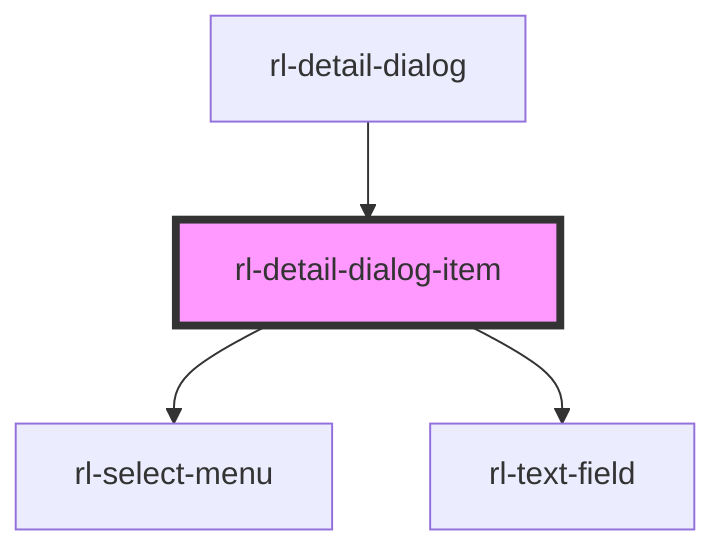

# rl-detail-dialog-item

<!-- Auto Generated Below -->

## Properties

| Property                       | Attribute | Description                                                             | Type                                                                            | Default     |
| ------------------------------ | --------- | ----------------------------------------------------------------------- | ------------------------------------------------------------------------------- | ----------- |
| `categoryOptions` _(required)_ | --        | An array of all the different categories that can be selected.          | `{ label: string; name: string; id: number; items: MapElementDetailType[]; }[]` | `undefined` |
| `detail`                       | --        | The `MapElementDetail` that this item is displaying the information of. | `MapElementDetail \| undefined`                                                 | `undefined` |

## Methods

### `getDetail() => Promise<MapElementDetail>`

Returns a `Promise` that resolves to a `MapElementDetail` object with
values set as those of this `DetailDialogItem`.

#### Returns

Type: `Promise<MapElementDetail>`

### `toRemove() => Promise<boolean>`

Returns a `Promise` that resolves to whether or not this `DetailDialogItem`
is to be removed or not.

#### Returns

Type: `Promise<boolean>`

## Dependencies

### Used by

 - [rl-detail-dialog](../detail-dialog)

### Depends on

- [rl-select-menu](../select-menu)
- [rl-text-field](../text-field)

### Graph

----------------------------------------------

*Built with [StencilJS](https://stenciljs.com/)*
