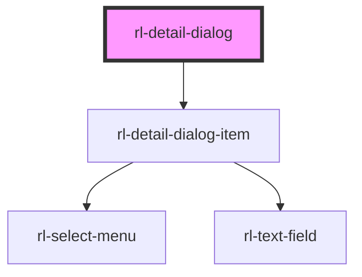

# rl-detail-dialog

<!-- Auto Generated Below -->

## Properties

| Property                  | Attribute      | Description                                                                                                                                                                                                                                                                                                                     | Type                                                                            | Default           |
| ------------------------- | -------------- | ------------------------------------------------------------------------------------------------------------------------------------------------------------------------------------------------------------------------------------------------------------------------------------------------------------------------------- | ------------------------------------------------------------------------------- | ----------------- |
| `categories` _(required)_ | --             | The different categories that each item can display.  Each category has a set of Detailtypes.                                                                                                                                                                                                                                   | `{ label: string; name: string; id: number; items: MapElementDetailType[]; }[]` | `undefined`       |
| `details`                 | --             | The details that will be displayed in this dialog.                                                                                                                                                                                                                                                                              | `MapElementDetailMap \| undefined`                                              | `undefined`       |
| `dialogActions`           | --             | An array of strings that will be used to create action buttons for the dialog.  When the corresponding button is clicked by the user, MDCDialog will emit an event with the lowercase version of the action. For example the action `Yes` would emit the `MDCDialog:closing` with the property `event.detail.action === 'yes'`. | `string[]`                                                                      | `['No', 'Yes']`   |
| `dialogTitle`             | `dialog-title` | The title of the dialog window.                                                                                                                                                                                                                                                                                                 | `string`                                                                        | `'Detail Dialog'` |

## Events

| Event       | Description                                                            | Type               |
| ----------- | ---------------------------------------------------------------------- | ------------------ |
| `addDetail` | An event emitted when a new `DetailDialogItem` is added to the dialog. | `CustomEvent<any>` |

## Methods

### `getDetails() => Promise<MapElementDetail[]>`

Returns the values of all the DetailDialogItems as an array of
`MapElementDetails`

#### Returns

Type: `Promise<MapElementDetail[]>`

### `open() => Promise<void>`

Opens this dialog.

#### Returns

Type: `Promise<void>`

## Dependencies

### Depends on

- [rl-detail-dialog-item](../detail-dialog-item)

### Graph

----------------------------------------------

*Built with [StencilJS](https://stenciljs.com/)*
