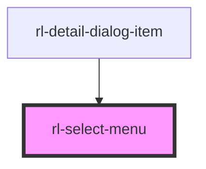

# rl-select-menu

<!-- Auto Generated Below -->

## Properties

| Property         | Attribute         | Description                                                     | Type       | Default |
| ---------------- | ----------------- | --------------------------------------------------------------- | ---------- | ------- |
| `label`          | `label`           | The label displayed on the select.                              | `string`   | `''`    |
| `options`        | --                | An array of the different options displayed in the select menu. | `string[]` | `[]`    |
| `selectedOption` | `selected-option` | The index of the currently selected option or `-1`.             | `number`   | `-1`    |

## Events

| Event      | Description                                                                                                   | Type                  |
| ---------- | ------------------------------------------------------------------------------------------------------------- | --------------------- |
| `selected` | An event emitted when an item is selected.  The detail of the event is set to the index of the item selected. | `CustomEvent<number>` |

## Dependencies

### Used by

 - [rl-detail-dialog-item](../detail-dialog-item)

### Graph

----------------------------------------------

*Built with [StencilJS](https://stenciljs.com/)*
