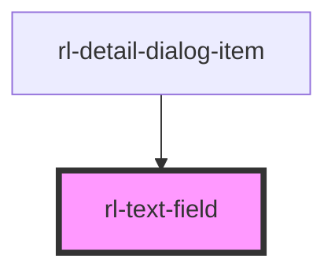

# rl-text-field

<!-- Auto Generated Below -->

## Properties

| Property       | Attribute       | Description                                                                    | Type                      | Default     |
| -------------- | --------------- | ------------------------------------------------------------------------------ | ------------------------- | ----------- |
| `disabled`     | `disabled`      | A flag indicating if the text field is disabled and does not allow user input. | `boolean`                 | `false`     |
| `fullwidth`    | `fullwidth`     | A flag indicating if the text field uses the full-width style.                 | `boolean`                 | `false`     |
| `helperText`   | `helper-text`   | Additional text displayed below the main text field.                           | `string`                  | `''`        |
| `icon`         | `icon`          | An icon displayed within the text field.                                       | `string`                  | `''`        |
| `iconLocation` | `icon-location` | The location of the icon displayed within the text field.                      | `"leading" \| "trailing"` | `'leading'` |
| `label`        | `label`         | The supplemental label for the text field.                                     | `string`                  | `''`        |
| `outlined`     | `outlined`      | A flag indicating if the text field has an outlined style.                     | `boolean`                 | `false`     |
| `textarea`     | `textarea`      | A flag indicating if the text field uses a textarea instead of an input.       | `boolean`                 | `false`     |
| `value`        | `value`         | The current value of the text field input or text area.                        | `string`                  | `''`        |

## Events

| Event         | Description                                                       | Type               |
| ------------- | ----------------------------------------------------------------- | ------------------ |
| `changeValue` | An event emitted when the value of the input or textarea changes. | `CustomEvent<any>` |

## Dependencies

### Used by

 - [rl-detail-dialog-item](../detail-dialog-item)

### Graph

----------------------------------------------

*Built with [StencilJS](https://stenciljs.com/)*
